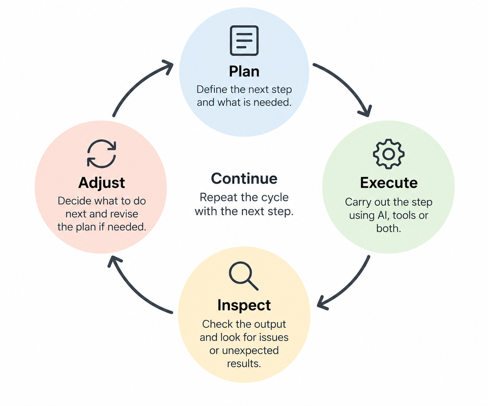

These notes are also based on the Coursera course [*Advanced Data Analysis with ChatGPT*](https://www.coursera.org/learn/advanced-data-analysis-with-chatgpt) by Jules White at Vanderbilt University. While the previous section focused on working with data, documents and files, this section takes a broader view of how more complex tasks can be organised as workflows involving humans, AI and other computational tools.

Working with a language model becomes more complicated when a task involves several steps. Rather than describing the entire task in a single prompt, it can be useful to think in terms of a **workflow**: how the task can be divided into steps, what each step requires and produces, and which parts should be performed by humans, AI or other computational tools.

# From prompts to workflows

A larger task can usually be divided into a sequence of smaller steps, where the output of one step becomes the input for another.

For example, analysing a collection of scientific papers might involve:

**identify relevant papers → extract information → organise the information → compare findings → interpret differences → produce a summary**

Not all of these steps necessarily require the same approach. Some may involve a language model, others may require search or computational tools, and some depend on human judgement.

# ETAC: structuring a larger task

One framework suggested by Jules White for breaking down larger tasks is **ETAC**:

**Extract → Transform → Analyze → Create**

The four stages describe different operations that may occur within a workflow. For example, when working with a collection of scientific papers:

| Stage | Purpose | Scientific-paper example |
|------------------------|------------------------|------------------------|
| **Extract** | Retrieve relevant information | Identify findings and retain their sources |
| **Transform** | Organise, clean or convert information | Structure findings for comparison |
| **Analyze** | Examine patterns and relationships | Compare findings and supporting evidence |
| **Create** | Produce an output | Prepare a summary or report |

ETAC provides a simple way of thinking about the different stages of a task. In practice, however, a workflow does not always proceed neatly from Extract to Transform to Analyze to Create. Individual steps may need to be repeated, intermediate results inspected, and earlier decisions revised before moving on.

# Dividing work between humans, AI and tools

Breaking a task into steps also makes it possible to consider **who or what should perform each step**. A workflow can combine human judgement, language models and other computational tools.

Different parts of a task are suited to different approaches. A language model can help extract and organise information, generate alternatives, explain results or plan the next step. Python or other computational tools can perform calculations, manipulate data and create visualisations, while specialised software may be needed for domain-specific analyses.

The human remains responsible for directing the workflow: defining the objective, providing relevant context, deciding which approaches are appropriate, inspecting intermediate results and judging whether the final result makes sense.

For example, in a data-analysis workflow, the work might be divided like this:

| Step | Possible role |
|----|----|
| Define the scientific question | Human |
| Inspect the structure of the dataset | AI + computational tools |
| Decide on an appropriate analysis | Human + AI |
| Perform calculations | Computational tools |
| Inspect and visualise results | Human + AI + computational tools |
| Interpret the results | Human + AI |
| Evaluate whether the conclusions are justified | Human |

These roles are not fixed. They depend on the task, available tools and consequences of an error. The important question is not whether a task should be performed by AI or a human, but **how their capabilities can be combined effectively**.

# Working iteratively

Larger tasks do not necessarily need to be planned completely before starting. A useful approach is to work iteratively:

**plan → execute → inspect → adjust → continue**

{fig-alt="Circular workflow showing Plan, Execute, Inspect and Adjust as an iterative cycle." width="80%"}

A first plan provides a starting point, but each step can produce new information that changes what should happen next. Intermediate results can be inspected before continuing, and the workflow adjusted when something unexpected appears.

For example, a data-analysis task might begin with a plan to inspect the data, clean it, perform an analysis and visualise the results. Inspecting the data may reveal missing values, unexpected distributions or problems with the experimental groups. These observations can change the next step rather than simply continuing with the original plan.

Working in smaller steps also makes it easier to identify where something has gone wrong. If the final result is unexpected, intermediate outputs provide points at which the workflow can be examined and revised.

# Assembling larger tasks

Breaking a larger task into smaller pieces makes the individual steps easier to manage, but the results eventually need to be brought together again.

For example, preparing a report from several sources might involve extracting information, organising tables, performing analyses and drafting individual sections. These intermediate outputs can be saved as files or structured data and then assembled into the final report.
